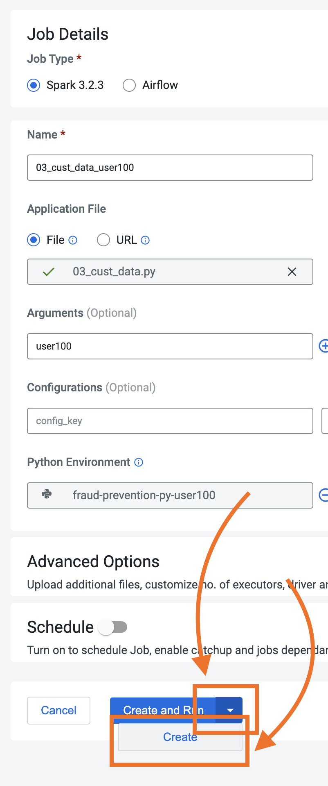
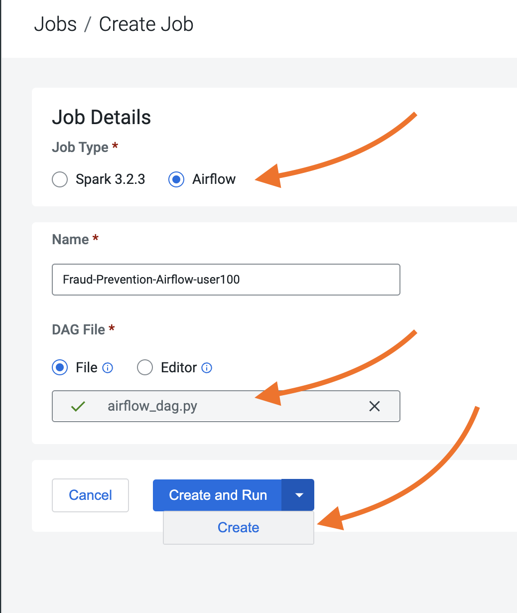
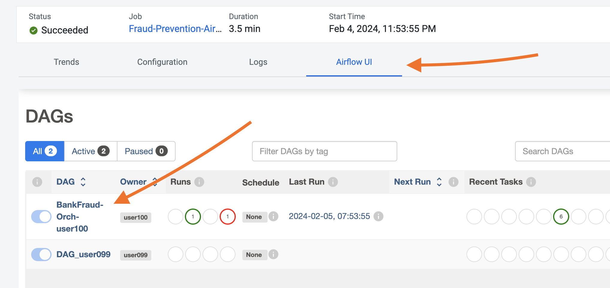
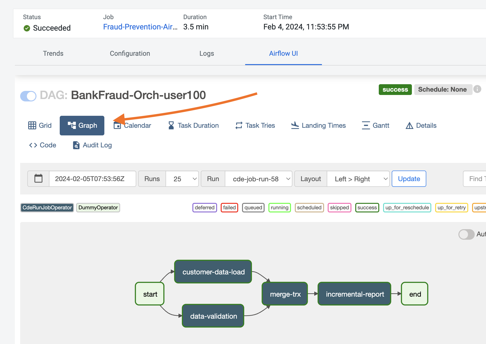
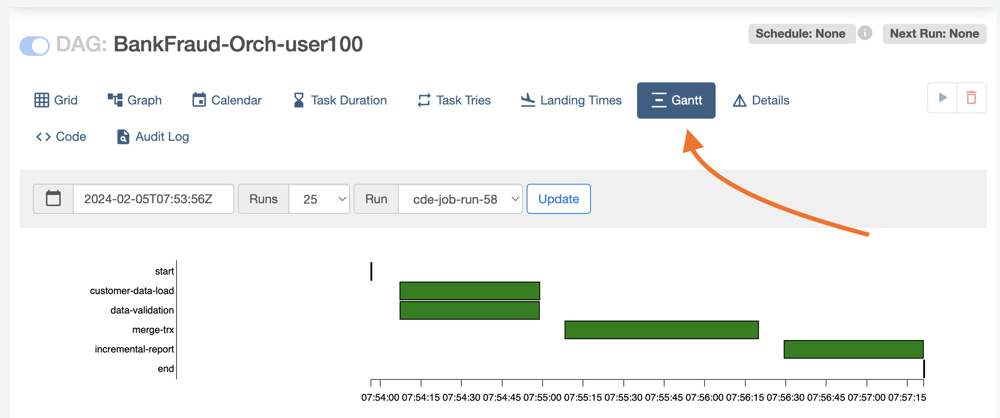

# Part 3: Apache Airflow in CDE

### A Brief Introduction to Airflow

Apache Airflow is a platform to author, schedule and execute Data Engineering pipelines. It is widely used by the community to create dynamic and robust workflows for batch Data Engineering use cases.

The main characteristic of Airflow workflows is that all workflows are defined in Python code. The Python code defining the worflow is stored as a collection of Airflow Tasks organized in a DAG. Tasks are defined by built-in opearators and Airflow modules. Operators are Python Classes that can be instantiated in order to perform predefined, parameterized actions.

CDE embeds Apache Airflow at the CDE Virtual Cluster level. It is automatically deployed for the CDE user during CDE Virtual Cluster creation and requires no maintenance on the part of the CDE Admin. In addition to the core Operators, CDE supports the CDEJobRunOperator and the CDWOperator in order to trigger Spark Jobs. and Datawarehousing queries.

### Lab 1: Orchestrate Spark Pipeline with Airflow

In this lab you will build a pipeline of Spark Jobs to load a new batch of transactions, join it with customer PII data, and create a report of customers who are likely victims of credit card fraud.

At a high level, the workflow will be similar to Part 1 and 2 where you created two tables and loaded a new batch of transactions. However, there are two differences:

1. The workflow will leverage all the features used up to this point but in unison. For example, Iceberg Time Travel will be used to create an incremental report including only updates within the latest batch rather than the entire historical dataset.
2. The entire workflow will be orchestrated by Airflow. This will allow you to run your jobs in parallel while implementing robust error handling logic.

##### Create CDE Spark Jobs

In this section you will create four CDE Spark Jobs via the CDE Jobs UI. It is important that you do not run the Spark Jobs when you create them. If you do run them by mistake, please raise your hand during the workshop and ask for someone to help you implement a workaround.

1. Data Validation:
  - Name: name this after your user e.g. if you are user "user010" call it "02_data_val_user010"
  - Application File: "02_data_validation.py" located in your CDE Files resource.
  - Arguments: enter your username here, without quotes (just text) e.g. if you are user "user010" enter "user010" without quotes
  - Python Environment: choose your CDE Python resource from the dropdown
  - Files & Resources: choose your CDE Files resource from the dropdown (this should have already been prefilled for you)
  - Leave all other settings to default values and run the job.

2. Customer Data Load:
  - Name: name this after your user e.g. if you are user "user010" call it "03_cust_data_user010"
  - Application File: "03_cust_data.py" located in your CDE Files resource.
  - Arguments: enter your username here, without quotes (just text) e.g. if you are user "user010" enter "user010" without quotes
  - Python Environment: choose your CDE Python resource from the dropdown
  - Files & Resources: choose your CDE Files resource from the dropdown (this should have already been prefilled for you)
  - Leave all other settings to default values and run the job.

3. Merge Transactions:
  - Name: name this after your user e.g. if you are user "user010" call it "04_merge_trx_user010"
  - Application File: "04_merge_trx.py" located in your CDE Files resource.
  - Arguments: enter your username here, without quotes (just text) e.g. if you are user "user010" enter "user010" without quotes
  - Files & Resources: choose your CDE Files resource from the dropdown (this should have already been prefilled for you)
  - Leave all other settings to default values and run the job.  

4. Incremental Report:
  - Name: name this after your user e.g. if you are user "user010" call it "05_inc_report_user010"
  - Application File: "04_incremental_report.py" located in your CDE Files resource.
  - Arguments: enter your username here, without quotes (just text) e.g. if you are user "user010" enter "user010" without quotes
  - Files & Resources: choose your CDE Files resource from the dropdown (this should have already been prefilled for you)
  - Leave all other settings to default values and run the job.  

##### Create Airflow Job

Open the "airflow_dag.py" script located in the "cde_airflow_jobs" folder. Familiarize yourself with the code an notice:

* The Python classes needed for the DAG Operators are imported at the top. Notice the CDEJobRunOperator is included to run Spark Jobs in CDE.
* The "default_args" dictionary includes options for scheduling, setting dependencies, and general execution.
* Four instances of the CDEJobRunOperator obect is declared with the following arguments:
  - Task ID: This is the name used by the Airflow UI to recognize the node in the DAG.
  - DAG: This has to be the name of the DAG object instance declared at line 16.
  - Job Name: This has to be the name of the Spark CDE Job created in step 1 above.
* Finally, at the bottom of the DAG, Task Dependencies are declared. With this statement you can specify the execution sequence of DAG tasks.

Edit the username variable at line 49. Then navigate to the CDE Jobs UI and create a new CDE Job.

Select Airflow as the Job Type, assign a unique CDE Job name based on your user, and then run the Job.  

Monitor the execution of the pipeline from the Job Runs UI. Notice an Airflow Job will be triggered and successively the four CDE Spark Jobs will run one by one.

While the job is in-flight open the Airflow UI and monitor execution.

### Summary

Each CDE virtual cluster includes an embedded instance of Apache Airflow. With Airflow based pipelines users can specify their Spark pipeline using a simple python configuration file called the Airflow DAG.

A basic CDE Airflow DAG can be composed of a mix of hive and spark operators that automatically run jobs on CDP Data Warehouse (CDW) and CDE, respectively; with the underlying security and governance provided by SDX.

### References

* [Automating Data Pipelines Using Apache Airflow in CDE](https://docs.cloudera.com/data-engineering/cloud/orchestrate-workflows/topics/cde-airflow-dag-pipeline.html)
* [Using CDE Airflow](https://github.com/pdefusco/Using_CDE_Airflow)
* [Airflow DAG Arguments Documentation](https://airflow.apache.org/docs/apache-airflow/stable/tutorial.html#default-arguments)
* [Exploring Iceberg Architecture](https://github.com/pdefusco/Exploring_Iceberg_Architecture)
* [Enterprise Data Quality at Scale in CDE with Great Expectations and CDE Custom Runtimes](https://community.cloudera.com/t5/Community-Articles/Enterprise-Data-Quality-at-Scale-with-Spark-and-Great/ta-p/378161)
